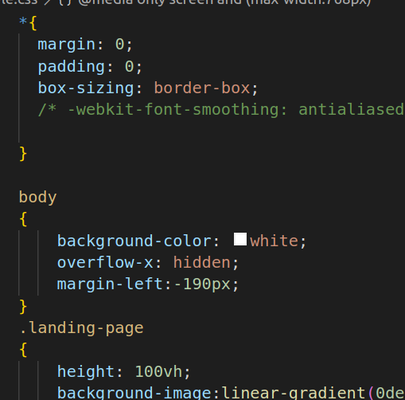
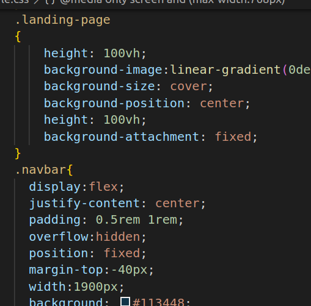
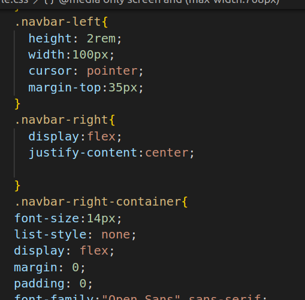
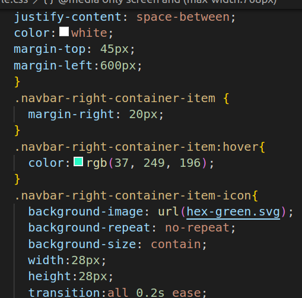
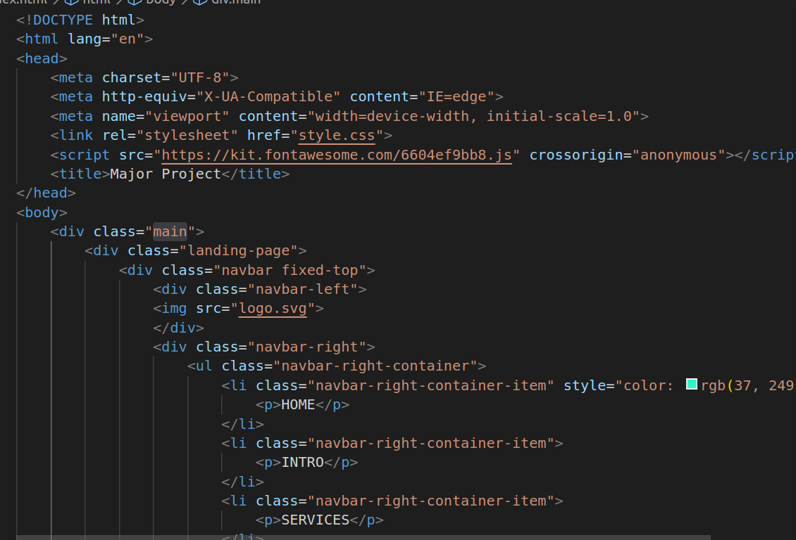
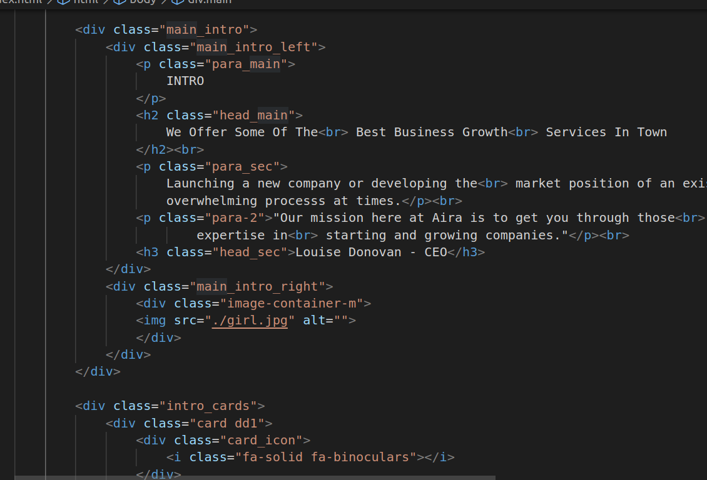
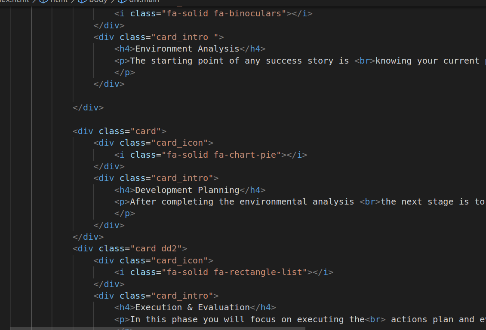
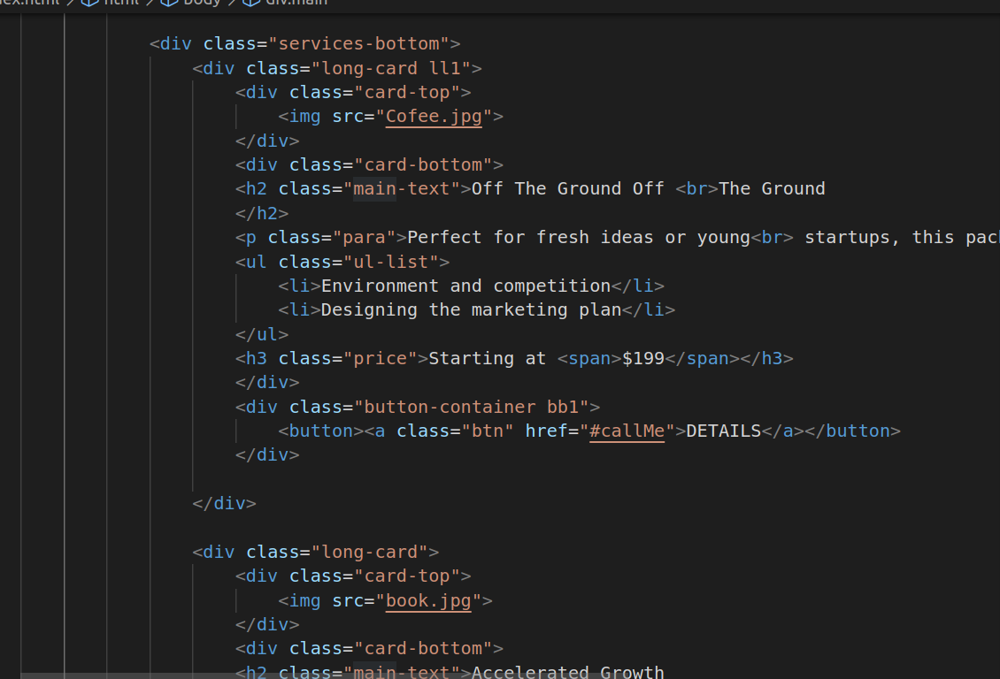
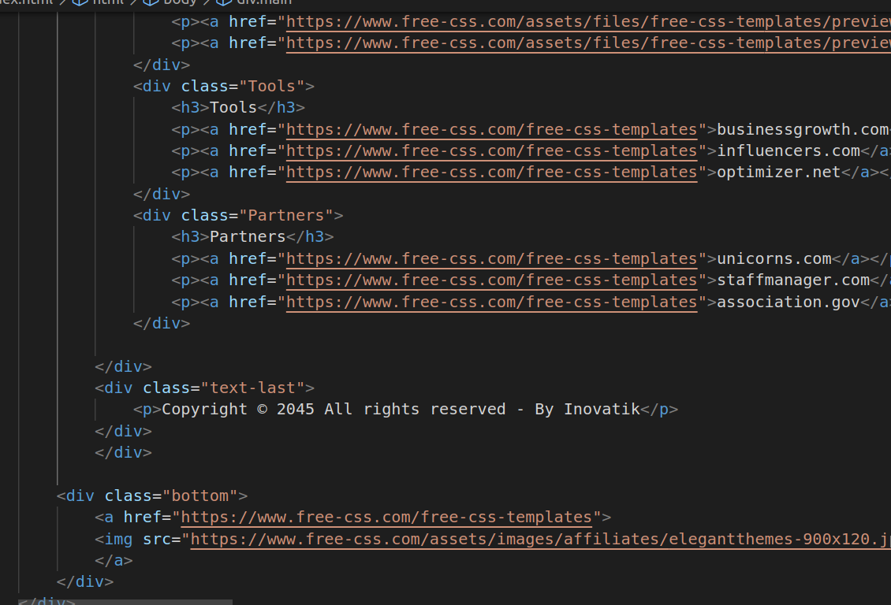

# Major Project
# Hosted Link

https://nikhitha5511.github.io/MajorProject/
1.

2.

3.

4.

* *: This is a universal selector, and it's used to target all elements on the web page. It's often used to apply a common set of styles to all elements.
* margin: 0; and padding: 0;: These rules reset the margin and padding of all elements to zero. This is a common practice called a "CSS reset" to ensure consistent spacing and layout across different browsers.
* box-sizing: border-box;: This rule changes the box model for all elements to "border-box." In the border-box model, an element's width and height include its padding and border, but not the margin. This can simplify layout calculations.
* background-color: white;: This sets the background color of the body element to white.
* overflow-x: hidden;: This rule hides horizontal overflow content on the body element. It's often used to prevent horizontal scrolling.
* margin-left: -190px;: This rule sets a negative left margin on the body element, effectively shifting the entire content 190 pixels to the left. This can be used for creating sidebars or off-canvas menus.
* .landing-page: This is a class selector that applies styles to an element with the class "landing-page." It sets the background image for this element using a linear gradient and a URL to an image file. It also specifies the background size, position, and attachment, creating a visually appealing background for the landing page.
* navbar: This class selector targets an element with the class "navbar." It's used to style the website's navigation bar. It sets the display to flex, making the navigation items horizontally aligned. It also gives it a fixed position, meaning it stays in place even when the page is scrolled. The background color is set to "#113448," giving it a dark blue color.
* navbar-left and .navbar-right: These classes target specific elements within the navigation bar. .navbar-left styles an element with a height of 2rem and a width of 100px, making it a clickable area, possibly a logo. .navbar-right is a container for the right side of the navigation bar.
* navbar-right-container: This class styles a container for the right side of the navigation bar. It sets the font size, list styles, and flex display. It also adjusts the color to white and positions the container with a margin-left of 600px.
* navbar-right-container-item: This class styles individual items within the navigation container. It adds some margin to the right of each item and changes the text color when hovered, possibly indicating links or menu items.
* navbar-right-container-item-icon: This class styles icons within the navigation items. It sets background images, adjusts their size, and adds a hover effect to change the icon color. It appears to use both background images and inline icons (represented by <i> elements).
* landing-center: This class is applied to a container in the center of the landing page. It's used to vertically and horizontally center its content, such as headings, paragraphs, and buttons.
* main-intro: This class is used to structure a section that contains two main columns: .main_intro_left and .main_intro_right. It's used to create a layout where content is divided into two parts, possibly for introducing the website's main features.
* image-container-m: This class is used to style an image container within the right column. It adds a hover effect that scales the image when hovered, creating an interactive element.
* para_main, .head_main, .para_sec, .para-2, .head_sec: These classes are applied to various text elements within the layout, specifying their fonts, sizes, and colors.
* intro_cards, .card_icon, .card_intro, .dd1, .dd2: These classes are used to style cards or sections within the layout, specifying fonts, colors, and margins for elements like icons, headings, and paragraphs.
* long-card: This class styles cards with a fixed width and height, a white background, and a border, suitable for displaying content like services or features.
* price: This class styles a pricing element, specifying the font, size, color, and margin.
* button-container button: This class styles buttons, specifying their background color, border, padding, and cursor on hover. These buttons seem to be used for calls to action or links.
* .services-bottom: This class appears to target a section or container related to services or features. It uses display: flex to arrange elements horizontally with space between them.
* card-bottom, .main-text, .para: These classes are used to style text elements within the services or features section, including headings and paragraphs.
* ul-list: This class targets unordered lists within the section, styling list items with square markers colored in "#14BF98."
* ul li::marker: This pseudo-element selector specifically styles the markers (bullets) of list items within unordered lists. In this case, it sets the color of the markers to "#14BF98."
* price span: This targets a specific span element within the pricing section, giving it a color of "#14BF98." This can be useful for highlighting specific parts of the pricing.
* button-container button: This class is used to style buttons within the services or features section. It specifies background color, border, padding, cursor, width, height, and margin, creating visually appealing buttons for interactions.
* text-sec h2: This class targets the heading element within a section, styling it with a font size of 28px, the "Montserrat" font family, a color of "#484A46," and margin adjustments for spacing.
* button1 and .button2: These classes style buttons. .button1 gives buttons a white color, a font size of 12px, and a background color of "#14BF98." It also adjusts the button's size, border radius, and margin. .button2 is for buttons with a different style, initially having a background color of "#F1F4F7" and a grayish text color. When hovered, it changes the text and background color to create an interactive effect.
* image-section: This class defines the layout for a section containing images. It's set up as a grid with four columns of 232px each, and the images within this grid have a hover effect that scales them up slightly.
* consultants and .text-2-consultants: These classes style text elements within a section, including headings and paragraphs. They set font sizes, font families, colors, and margins for spacing.
* image2-container: This class defines a layout for a container that likely holds images or icons. It uses flex properties for spacing and alignment.
* text-image: This class styles paragraphs within a section, adjusting their color, font size, font family, and margin.
* about: This class targets a section or container labeled as "About" in the design. It employs flex properties for layout, alignment, and spacing adjustments.
* bold-container and .bold: These classes define a styling for bold text elements, such as headings. .bold sets the text color to "#14BF98" and gives it a large font size and font weight. The span inside the .bold-container provides additional styling for the accompanying text.
* text1-contact-form and .text-para-contact: These classes style text elements within a contact form section, specifying font size, font family, color, margin, and line height.
* text-contact-container h2: This class styles a heading within a contact section, setting font size, font family, color, and margin.
* icon-contact and .icons-nav: These classes target icons or links related to contact information. They specify font size, font family, color, and margin for the icons.
* form-container-contact: This class seems to define styling for a contact form container. It adjusts the margin, positioning the form on the right side of the page.
* social-links h3: This class styles a heading related to social links, setting font size, font family, color, and margins.
* details-text and .text-area: These classes define styles for text input and text area fields in a form, specifying width, height, and line height.
* checkbox-form and .checkbox-label a: These classes likely style checkboxes within a form and provide styling for associated labels or links.
* form-container-contact button: This class styles the submit button within a contact form. It specifies the background color, width, height, font size, font family, color, and removes the border.
* copyright-container and related classes: These classes style the footer section of the page, adjusting background color, margins, and font styles for text and links.
* copyright-container and .copyright: These classes target the footer section of the webpage. They set a background color and adjust the layout of the footer elements using flex properties.
* text-copyright h3 and .text-copyright p: These classes style the heading and paragraphs within the footer section, specifying font size, font family, color, and margins.
* links h3 and .links a: These classes style headings and links that may be related to external links or resources. They specify font size, font family, and link colors.
* Tools and .Tools a: These classes likely style text and links related to tools or resources. They set font size, font family, and link colors.
* Partners h3 and .Partners a: These classes style headings and links related to partners or affiliates. They set font size, font family, and link colors.
* text-last and .bottom: These classes style the text and potentially provide margin adjustments. .text-last specifies font color and margin-top, while .bottom adjusts margin-top.
* Media Query: At the end of CSS code,  have a media query that targets screens with a maximum width of 768px. Within this query, you have defined styles for the .main class to control its layout when the screen width is below 768px. This helps ensure your website's responsiveness on smaller screens.

12.

13.

14.

15.

20.

* div class="main": This is the main container for your entire webpage.
* div class="landing-page": Represents the landing page section of your website.
* div class="navbar fixed-top": The navigation bar at the top of your webpage, which contains your logo and navigation links.
* div class="landing-center": The central content of your landing page, including the main heading, a brief description, and a "DISCOVER" button.
* div class="main_intro": The main introduction section, with two columns for text and an image.
* div class="main_intro_left": The left column of the main introduction, containing text.
* div class="main_intro_right": The right column of the main introduction, containing an image.
* div class="intro_cards": A section containing three cards with icons and text.
* div class="services": Represents the services section of your webpage.
* div class="services_top": The top part of the services section with a heading and subheading.
* div class="services-bottom": Contains three cards with service details.
* div class="long-card": Each card within the services section.
* div class="data-collapse" id="details": A collapsible data section.
* div class="image-left" and div class="image-right": Two columns for images within the data-collapse section.
* div class="text-right" and div class="text-left": Two columns for text within the data-collapse section.
* div class="carousel": Represents a carousel section.
* div class="carousel-text": Text content within the carousel section.
* div class="carousel_container": Container for the carousel cards.
* div class="carousel_card": Individual cards within the carousel.
* div class="form-container": A container for the form section.
* div class="text-form": Text content within the form section.
* div class="form": The form itself, containing input fields, a select menu, a checkbox, and a submit button.
* input> and select: Input fields for collecting user information and selecting a service.
* input type="checkbox": A checkbox for agreeing to the Privacy Policy and Terms & Conditions.
* button class="form-button": The submit button for the form.

